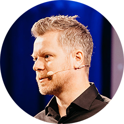

# Ariton - The SuperApp for Communities

Discover, create, and join communities that match your interests and passions.

Ariton is a (future) superapp that lets you create and join communities of any kind, 
based on your hobbies, ideas, philosophy, faith or anything else. 

Built on free and open standards, Ariton gives you the power and ownership of 
your own identities and data.

Ariton brings your real life communities into the digital world, by giving you 
access to a rich set of features that covers the needs to run complete communities.

Ariton is not just another app that collects your data, but a tool to help grow 
your communities and adopt decentralized technologies that empowers the community, 
and its users.

## Economy of Communities

Ariton is a re-envisioning of the economy for human societies that builds on a new foundation of modern solutions that helps elevate the participants into a better tomorrow.

While Bitcoin gave us sound money, a human society needs so much more. Ariton is a (future) superapp that integrates the latest in decentralized technologies and protocols, allowing anyone to launch their own communities, privately or publicly.

These communities will bring together people, allowing a more free expression and digital lifestyle that is traditionally prohibited on the Internet today.

Ariton is decentralized in such a manner that makes it hard to be stopped, and is easy for the general audience to contribute with strengthening the network as a whole.

Ariton makes the participants in the communities, owner of their own digital data and online presence. Instead of your personal data being used to monetize you, you own and control your own data and how it is shared with others.

## Communities

Ariton revolves around communities. You can create and join communities of many kinds, for example "The Knitting Group", which could have instructors, educators, hints and tips, buy and sell and more within the community.

A community has no boundries, but can be local and regional, or global and universal.

Community owners can earn income from their communities. As a community grows and the quality of content and contributors within it is able to sell their goods and services, the community owners can decide if they want to have a community fee added to various features within the community. This is a way for community manager to reap some rewards from curating a great community.

## Who wants to use Ariton?

Anyone who want to establish a community that involves around ownership of data and commercial trade within their communities.

## How to think about Ariton?

Think of Ariton as a digitalization of your local (and global) communities. Where you communicate privately with your friends and community, without any third parties listening on your conversations. How you can exchange goods and services with your friends and community, without third parties being involved. This is Ariton.

## Who will build Ariton?

Without the advances in open standards on decentralized identifiers, Ariton wouldn't be possible. Launching Ariton comes at the exact time when foundations are laid to develop such an superapp.

|   | About us |
| --- | --- |
|  | **Sondre Bjellås** (Chief Product Engineer) - With more than three decades of experience with software development, he has extensive experience with technology, languages, patterns and practices, both in building large scalable systems, web apps and decentralized software. His relentless focus on rapid release cycles allows Ariton to develop and adopt to its users and market without delays.  |
|  | **Dan Gershony** (Chief Technology Officer) - With experience from blockchains and former CTO role in a large British player in the blockchain space, Dan brings insight and capabilities to the Ariton team that will ensure success and quality of delivery.|
|  | **Milad Raeisi** (Software Engineer) - He is a seasoned Software Architect and Programmer with over 20 years of experience. As a Senior Developer, he specializes in software development, UI/UX design, data science, AI, and blockchain. His expertise in building large-scale systems and decentralized applications drives innovation and quality at Ariton.|


## Features

### Identity

Anyone can make any number of identifiers and build their identity around that identifier. Users can self-determine what metadata they want to share connected to their identifier, such as name and profile image. Ariton supports multiple identity providers that builds on the open standard for decentralized identifiers (DID).

### Marketplace

Within each community there are marketplaces that allows users to post their offers for sale of goods and services. Purchase of digital assets, such as tickets, can be saved into the users personal data storage (DWN) for safe-keeping.

### Registries

Anyone can provide "Registry as a Service" within a community, which are curated lists of data. Examples for this are Land Registry and Business Registry.

### Verification

Anyone can provide "Verification as a Service" within a community, which is a provider that verifies the authenticity of data (verifiable credentials) or identities (DID). These veriication services can issue identity cards to users based upon a set of rules the verification provider decides.

### Data

Anyone can provide "Data as a Serviced" within a community, which can be any type of data, but one specific data provider would be approved lists of content for children.

A data provider could have different curated lists of approved content, that are tagged with metadata and age-related tagging, allowing parents to subscribe (free or paid service) to data providers and utilize those data lists in apps for children.

Other examples on data, could be a curated list of anarchy communities, or network states, or free cities.

### Reputation

Reputations are important in the digital world, as a means to filter out noise and problematic actors. Within a community on Ariton, individuals will build up reputations connected to their identifiers.

## Technologies and Protocols

Ariton builds on [decentralized identifiers](https://developer.tbd.website/docs/web5/learn/decentralized-identifiers) (DID), [verifiable credentials](https://developer.tbd.website/docs/web5/learn/verifiable-credentials) (VC), [decentralized web nodes](https://developer.tbd.website/docs/web5/learn/decentralized-web-nodes/) (DWN) by [TBD](https://www.tbd.website/), [Codex](https://blog.codex.storage/decentralised-storage-for-virtual-self-sovereign-territories/) by [Institute of Free Technology](https://free.technology/) (under consideration, might be too dependent on blockchain), [Fedimint](https://fedimint.org/) (Bitcoin federation for privacy and community trading), [Nostr](https://nostr.com/) (communication relay protocol and technology).

## Inspiration

The Bitcoin whitepaper references [b-money.txt](http://www.weidai.com/bmoney.txt) written by Wei Dai, which contains the following phrase:

```txt
It's a community where the threat of violence is
impotent because violence is impossible, and violence is impossible
because its participants cannot be linked to their true names or physical
locations.
```

Your Ariton identities is your own, it is not linked or connected to your existing birthname or identity used in real life. You can be yourself, how you want to be.

## Funding

Ariton is seeking investements and funding to continue the development of the new superapp. Behind the project is individuals who have a track record of delivering, wealth of knowledge and experience.
